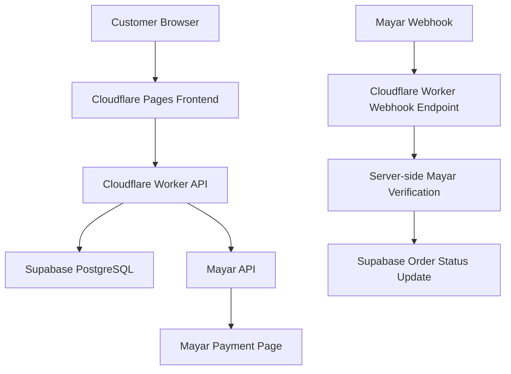

# ADR 0001 — Architecture Baseline WarungKit

**Status:** Accepted
**Tanggal:** 2026-07-04
**Proyek:** WarungKit
**Sumber kebenaran terkait:** `docs/WarungKit_BRD_Technical_Blueprint_v1.0.pdf`, `docs/PROJECT_CHECKLIST.md`, `CLAUDE.md`

---

## Context

WarungKit adalah demo webinar 60 menit yang menunjukkan storefront digital aman untuk UMKM Indonesia. Tujuannya adalah membangun sebuah MVP yang production-aware — cukup nyata untuk membuktikan bahwa alur checkout-ke-pembayaran dapat dibangun dengan aman menggunakan AI-assisted development (Claude Code), tanpa mengorbankan batasan keamanan dasar.

Proyek ini bukan aplikasi komersial. Prioritas utama adalah keandalan demo live dan keamanan alur pembayaran inti — bukan skala enterprise, bukan fitur lengkap, bukan multi-tenant.

Keputusan arsitektur berikut mengunci pilihan teknologi dan batas tanggung jawab setiap komponen agar tidak berubah-ubah mendekati hari-H webinar.

## Decision

WarungKit dibangun dengan arsitektur berikut:

| Area | Keputusan |
|---|---|
| Frontend | React + Vite + TypeScript + Tailwind CSS |
| Hosting frontend | Cloudflare Pages |
| Backend | Hono API di atas Cloudflare Workers |
| Database | Supabase PostgreSQL |
| Payment | Mayar (invoice/payment-link flow) |
| Validasi bersama | Zod (`packages/contracts`) |
| Package manager | pnpm, model monorepo |
| Domain kustom | Tidak dibutuhkan untuk webinar |
| URL publik frontend | `warungkit-demo.pages.dev` |
| URL publik backend | `warungkit-api.<cloudflare-subdomain>.workers.dev` |

Model kepercayaan inti: **browser hanya mengirim niat (intent), backend memutuskan kebenaran (truth), database mencatat kebenaran, dan status pembayaran hanya berubah setelah verifikasi server-side terhadap Mayar.**

**Catatan kompatibilitas penamaan Supabase:** BRD PDF mungkin menyebut kredensial backend Supabase dengan istilah lama "service role key". Standar implementasi WarungKit menggunakan `SUPABASE_SECRET_KEY` (format Supabase secret key terkini) untuk variabel yang sama — hanya backend-only, hanya tersimpan di Cloudflare Worker secret, tidak pernah terekspos ke browser.

## Architecture Diagram

Catatan alur: jalur atas (A→B→C→D, C→E→F) adalah alur checkout dan pembuatan pembayaran. Jalur bawah (G→H→I→J) adalah alur konfirmasi pembayaran yang berjalan independen, dipicu oleh Mayar, bukan oleh browser.

## Component Responsibilities

| Komponen | Tanggung Jawab |
|---|---|
| Customer Browser | Menampilkan katalog, mengumpulkan data checkout, memulai proses checkout, membaca/polling status pembayaran. Tidak pernah memegang kebenaran bisnis (harga, status paid, kredensial). |
| Cloudflare Pages | Meng-hosting artefak frontend statis dan menjadi titik masuk publik untuk browser. |
| Cloudflare Worker API | Memvalidasi request, meresolusi harga produk dari database, membuat order, memanggil Mayar, memproses webhook, memverifikasi status, memperbarui order, menerapkan CORS, request ID, dan error yang aman. |
| Supabase PostgreSQL | Menyimpan produk, order, metadata payment event, dan idempotency record. RLS aktif; akses backend penuh (`SUPABASE_SECRET_KEY`) hanya dari Worker. |
| Mayar | Meng-hosting halaman pembayaran, menerima pembayaran, dan mengirim event/identifier pembayaran yang digunakan untuk verifikasi server-side. |
| Claude Code | Mempercepat perencanaan dan implementasi, tetapi tidak menggantikan review, testing, atau tanggung jawab keamanan manusia. |

## Trust Boundaries

| Zona | Definisi |
|---|---|
| Zona tidak tepercaya (untrusted) | Browser pelanggan, penyimpanan browser, data form masuk, parameter redirect, dan request internet publik apa pun. |
| Zona API terkontrol | Cloudflare Worker — memvalidasi seluruh input klien dan hanya mengekspos respons yang aman untuk publik. |
| Zona data terproteksi | Akses backend Supabase (`SUPABASE_SECRET_KEY`), kunci pembayaran, dan logic mutasi order. |
| Zona provider eksternal | Respons dan payload webhook Mayar dianggap input eksternal tidak tepercaya sampai diverifikasi. |

## Primary Payment Flow

| Langkah | Aturan Pemrosesan |
|---|---|
| A | Frontend mengirim `productId`, data customer, dan idempotency key ke `POST /api/checkout`. |
| B | Worker memvalidasi input dan mengambil produk beserta harga kanonis dari database. |
| C | Worker menulis order `pending` dan memanggil Mayar menggunakan secret server-side. |
| D | Worker menyimpan identifier pembayaran dan mengembalikan payment URL ke browser. |
| E | Customer membayar di halaman pembayaran yang di-hosting provider. |
| F | Webhook provider memanggil `POST /api/webhooks/mayar`. |
| G | Worker mencatat event secara aman, memverifikasi status pembayaran server-side, dan melakukan transisi status idempotent. |
| H | Order menjadi `paid` hanya setelah verifikasi. Halaman status mencerminkan state database. |

## Why Browser Must Not Call Mayar Directly

Jika browser memanggil Mayar langsung, kredensial API Mayar harus ada di kode/bundle frontend agar bisa melakukan autentikasi ke Mayar. Kredensial di sisi klien selalu dapat diekstraksi oleh siapa pun yang membuka dev tools. Dengan memaksa semua panggilan Mayar melalui Worker, kunci API tetap berada di secret server-side dan tidak pernah terpapar ke publik.

## Why Browser Must Not Access Sensitive Order Tables

Order, payment event, dan data idempotency berisi informasi bisnis yang menentukan apakah suatu transaksi sah dan telah dibayar. Jika browser bisa membaca atau menulis tabel-tabel ini secara langsung (baik lewat query langsung maupun lewat kunci anon yang terlalu permisif), pengguna dapat melihat data pelanggan lain atau memanipulasi status order miliknya sendiri. Akses hanya diperbolehkan melalui repository layer di backend, dengan RLS sebagai lapisan pertahanan tambahan di database.

## Why Price Is Resolved From Database

Harga yang dikirim dari klien dapat diubah dengan mudah melalui dev tools atau intersepsi request. Jika backend mempercayai harga dari body request, penyerang dapat membeli produk apa pun dengan harga berapa pun yang mereka tentukan. Karena itu, backend selalu mengambil ulang harga dari `products.price_idr` berdasarkan `productId` yang dikirim klien — klien hanya mengirim niat, bukan nilai transaksi.

## Why Redirect Is Not Payment Proof

Redirect setelah pembayaran adalah peristiwa pengalaman pengguna (UX), sepenuhnya dikendalikan oleh browser dan dapat dipalsukan hanya dengan mengetik ulang URL sukses secara manual — tanpa benar-benar membayar apa pun. Karena redirect tidak melibatkan verifikasi apa pun terhadap provider pembayaran, ia tidak bisa dijadikan bukti bahwa uang benar-benar diterima.

## Why Webhook Must Be Verified Server-Side

Payload webhook yang diterima Worker adalah input eksternal yang bisa saja dipalsukan oleh pihak yang mengetahui atau menebak endpoint webhook publik. Karena itu, event webhook tidak langsung dipercaya begitu saja — Worker melakukan panggilan balik server-side ke Mayar API untuk mengonfirmasi status pembayaran yang sebenarnya sebelum mengubah status order menjadi `paid`. Ini menjadikan Mayar API (bukan payload webhook mentah) sebagai sumber kebenaran akhir untuk status pembayaran.

## Non-Goals for Webinar MVP

- Multi-item cart atau keranjang belanja.
- Akun pelanggan dan autentikasi pengguna.
- Admin console penuh (lihat keputusan Q-04 di `docs/PROJECT_CHECKLIST.md` — observabilitas cukup lewat dashboard Supabase terkontrol untuk presenter).
- Manajemen stok dan logistik pengiriman.
- Otomasi refund.
- Invoice PDF dan notifikasi WhatsApp otomatis.
- Model multi-merchant.
- Domain kustom dan go-live komersial.

## Consequences and Trade-offs

- **Konsekuensi positif:** Batas kepercayaan yang jelas antara browser, backend, database, dan provider pembayaran membuat model keamanan mudah dijelaskan kepada audiens webinar dan mudah diaudit oleh tim.
- **Konsekuensi positif:** Struktur monorepo pnpm dengan kontrak Zod bersama mengurangi duplikasi validasi antara frontend dan backend.
- **Trade-off:** URL publik Cloudflare Pages/Workers tanpa domain kustom berarti URL webhook dan CORS allowlist harus dikunci lebih awal (lihat P4 di `docs/PROJECT_CHECKLIST.md`) dan tidak boleh berubah mendekati hari-H, karena perubahan nama project akan merusak registrasi webhook Mayar.
- **Trade-off:** Karena tidak ada admin console, observabilitas demo bergantung pada dashboard Supabase — ini cukup untuk webinar tapi bukan solusi observabilitas jangka panjang bila proyek dilanjutkan ke arah komersial.
- **Trade-off:** Karena scope MVP sengaja sempit (non-goals di atas), ekstensi ke arah produksi nyata (Section 9.4 BRD — "Production future") memerlukan pekerjaan tambahan yang signifikan di luar cakupan webinar ini.

## Decision Status

**Accepted.** Keputusan ini mengikat seluruh implementasi P4 ke atas di `docs/PROJECT_CHECKLIST.md` dan tidak boleh diubah tanpa ADR baru yang menggantikannya secara eksplisit.
